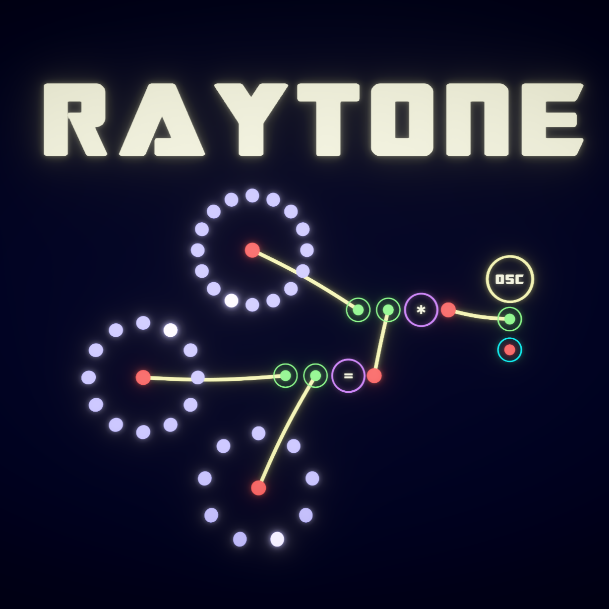

# RayTone
## A Node-based Audiovisual Sequencing Environment
**_RayTone_** is a node-based software environment for creating audiovisual compositions. The software emphasizes the aesthetics and joy of patching procedures, aiming to promote a playful workflow for transforming creative ideas into artistic content. RayTone allows for native access to ChucK music programming language and OpenGL Shading Language (GLSL), affording programmability of arbitrary complexity inside each node on canvas.

More information about the project can be found at: https://www.raytone.app

---

Developed and maintained by Eito Murakami and John Burnett with support provided by Center for Computer Research in Music and Acoustics (CCRMA) at Stanford University.

Copyright 2024 Eito Murakami and John Burnett \
Licensed under the Apache License, Version 2.0.

